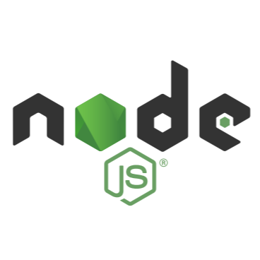

## Hi there 👋
### Me chamo Felipe e sou apaixonada na computação 😄. 
### Bora compartilhar nossas experiências?.

 📄Veja mais sobre mim no LinkedIn: https://www.linkedin.com/in/felipe-silva-siqueira-315902222/

  

    
  

  

     
  
 

 
 
 
 
 
 
 
 
 
 

## Languages and Tools:

 
   
    
    
   
   
   
  
   
   
   
   
   
   

<!--
**wesleymarchi/wesleymarchi** is a ✨ _special_ ✨ repository because its `README.md` (this file) appears on your GitHub profile.
Here are some ideas to get you started:
- 🔭 I’m currently working on ...
- 🌱 I’m currently learning ...
- 👯 I’m looking to collaborate on ...
- 🤔 I’m looking for help with ...
- 💬 Ask me about ...
- 📫 How to reach me: ...
- 😄 Pronouns: ...
- ⚡ Fun fact: ...
-->