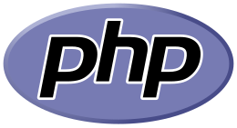
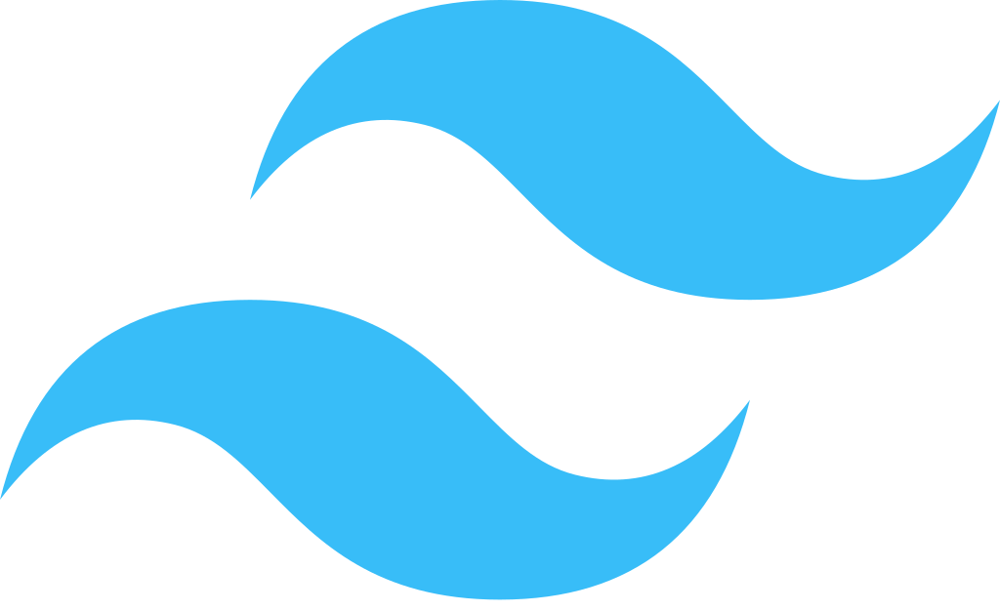
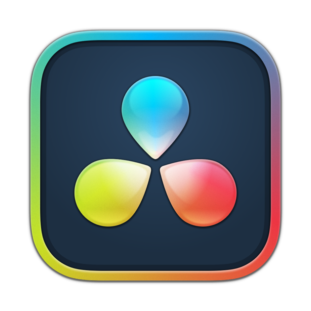

## "Todos deveriam aprender a programar um computador, pois isto ensina a pensar." - Steve Jobs
### Me chamo Felipe e sou apaixonado pela computação 💻. 
### Bora compartilhar nossas experiências?

 📄 Veja mais sobre mim no LinkedIn: https://www.linkedin.com/in/felipe-silva-siqueira-315902222/

  

    
  

  

     
  
 

 
 
 
 
 
 
 
 
 
 

Programar é uma das minhas grandes paixões. Não faço isso apenas por retorno financeiro, mas pela incrível possibilidade de transformar ideias em realidade, é como se fosse magica! Basta uma ideia, um livro de código ou até um vídeo no YouTube, aprendendo e colocando em prática, posso criar o que minha imaginação permitir. Gosto de desafiar minha criatividade o tempo todo, desenvolvendo diversos projetos e sempre buscando me superar.

 
 

## Linguagens e Ferramentas:

 
   
   
     
     
  </a> 
     
    
    
   
   
   
  
   
   
   
   
   
   

<!--
**wesleymarchi/wesleymarchi** is a ✨ _special_ ✨ repository because its `README.md` (this file) appears on your GitHub profile.
Here are some ideas to get you started:
- 🔭 I’m currently working on ...
- 🌱 I’m currently learning ...
- 👯 I’m looking to collaborate on ...
- 🤔 I’m looking for help with ...
- 💬 Ask me about ...
- 📫 How to reach me: ...
- 😄 Pronouns: ...
- ⚡ Fun fact: ...
-->